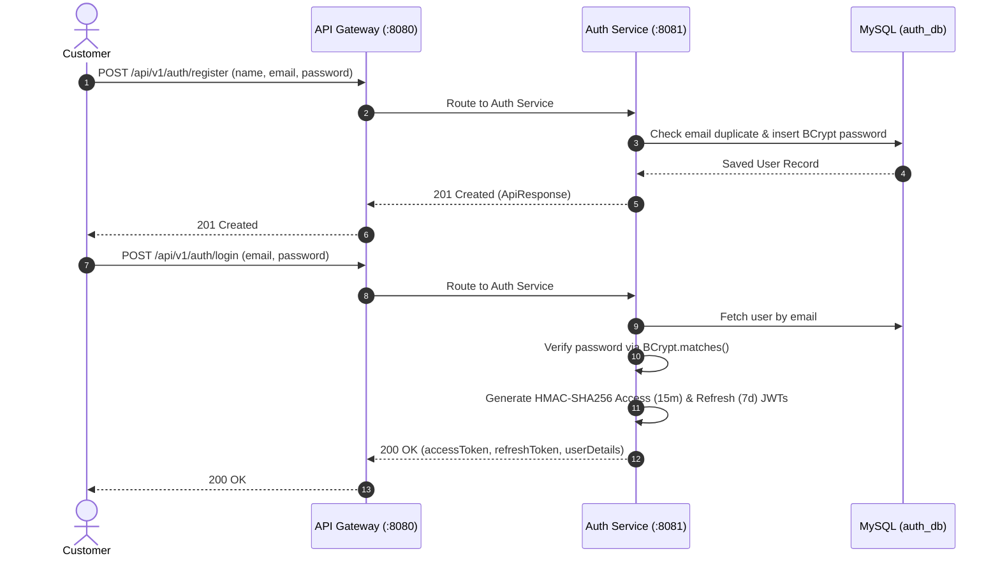
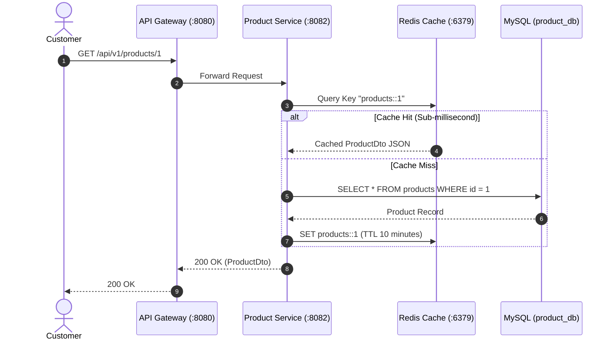
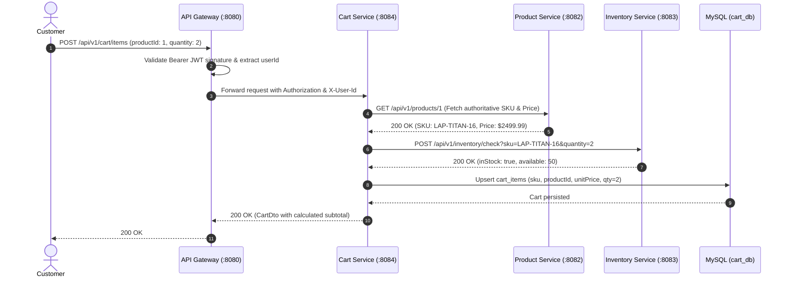
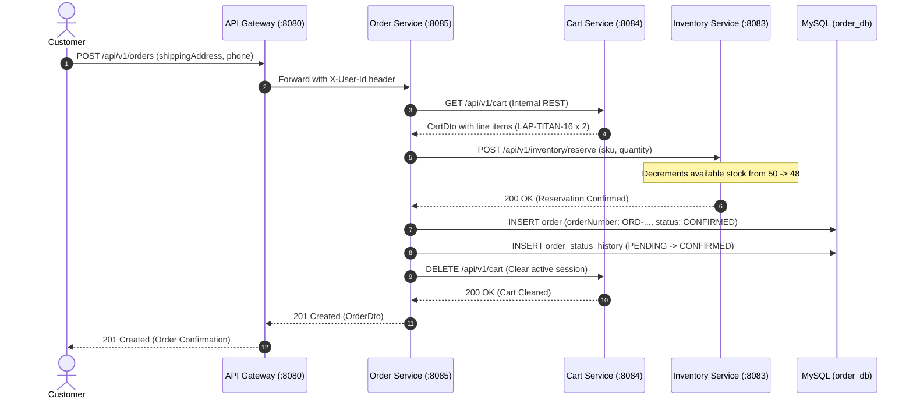
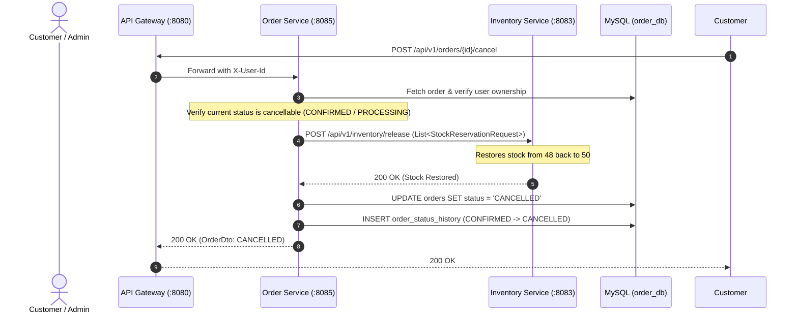

# Enterprise E-Commerce Platform — Complete Architecture, HLD, LLD & Execution Guide

This document provides a production-grade architectural specification, High-Level Design (HLD), Low-Level Design (LLD), system design principles, and end-to-end execution flow reference for the **Enterprise Microservices E-Commerce Platform**.

---

## 1. High-Level Design (HLD) & System Architecture

The platform follows modern cloud-native microservice principles: **Zero Monolithic Shared Databases**, **Centralized Ingress Gateway**, **Stateless JWT Security**, and **Domain-Driven Bounded Contexts**.

### 1.1 Architecture Topology

```mermaid
graph TD
    Client["Client Layer<br/>React 18 + TypeScript + Vite SPA<br/>(Port 3000 / Nginx)"]
    Gateway["API Gateway (Spring Cloud Gateway / Netty)<br/>Port 8080<br/>• Central Ingress Routing<br/>• JWT Validation & Header Enrichment<br/>• Global CORS & Rate Limiting"]

    subgraph Microservices ["Microservices Layer (Java 21 / Spring Boot 3)"]
        Auth["Auth Service (:8081)<br/>• BCrypt Hashing<br/>• JWT Generation & Refresh<br/>• RBAC (USER / ADMIN)"]
        Product["Product Service (:8082)<br/>• Catalog & Categories<br/>• Redis Read-Through Cache<br/>• SKU Authoritative Specs"]
        Inventory["Inventory Service (:8083)<br/>• Atomic Stock Reservations<br/>• Restock Release Mechanism<br/>• Concurrency Protection"]
        Cart["Cart Service (:8084)<br/>• Active User Cart Sessions<br/>• Snapshot Price Locking<br/>• Transient Line Items"]
        Order["Order Service (:8085)<br/>• Distributed Checkout Saga<br/>• Order State Machine<br/>• Audit Status History"]
    end

    subgraph DataTier ["Data & Caching Tier"]
        MySQL[("MySQL 8 Database Container (:3306)<br/>5 Logical Isolated Schemas:<br/>auth_db · product_db · inventory_db<br/>cart_db · order_db")]
        Redis[("Redis 7 Alpine Cache (:6379)<br/>Distributed In-Memory Cache<br/>Product Serialization + TTL")]
    end

    Client -->|HTTP / REST (JSON)| Gateway
    Gateway -->|/api/v1/auth/**| Auth
    Gateway -->|/api/v1/products/**, /categories/**| Product
    Gateway -->|/api/v1/inventory/**| Inventory
    Gateway -->|/api/v1/cart/**| Cart
    Gateway -->|/api/v1/orders/**| Order

    Product <-->|Read / Write Distributed Cache| Redis
    
    Order -.->|Internal REST| Product
    Order -.->|Internal REST| Inventory
    Order -.->|Internal REST| Cart
    Cart -.->|Internal REST| Product
    Cart -.->|Internal REST| Inventory

    Auth -->|JPA / Flyway| MySQL
    Product -->|JPA / Flyway| MySQL
    Inventory -->|JPA / Flyway| MySQL
    Cart -->|JPA / Flyway| MySQL
    Order -->|JPA / Flyway| MySQL
```

### 1.2 Core Architectural Principles & Trade-offs
1. **Database-per-Service Pattern**: Each microservice exclusively owns its schema. Direct cross-database joins or foreign keys across service boundaries are strictly forbidden. This ensures independent schema migrations and zero blast radius during updates.
2. **Shared-Nothing Asynchronous Ingress**: The API Gateway runs on Spring Cloud Gateway with Project Reactor / Netty, handling thousands of concurrent client connections without thread-per-request blocking.
3. **Decoupled Inter-Service Communication**: Microservices communicate over standard REST contracts using internal `RestTemplate` / HTTP client calls with explicit timeouts and header forwarding (`X-User-Id`, `X-User-Roles`).
4. **Distributed Caching (Cache-Aside Pattern)**: Product queries prioritize Redis (`products::{id}`). On cache misses, data is read from MySQL, hydrated into Redis with a 10-minute TTL, and serialized using Jackson's `JavaTimeModule` for instant sub-millisecond retrieval.
5. **Data Consistency & Compensating Transactions**: The checkout process coordinates distributed actions:
   - Verify cart items $\rightarrow$ Atomically reserve stock $\rightarrow$ Persist order $\rightarrow$ Clear user cart.
   - If an order is subsequently cancelled, a compensating transaction automatically triggers an inventory release.

---

## 2. Low-Level Design (LLD) & Design Patterns Implemented

The platform adheres to clean code standards, SOLID principles, and proven object-oriented design patterns:

### 2.1 Software Design Patterns

| Pattern | Implementation in Codebase | Technical Benefit |
| :--- | :--- | :--- |
| **API Gateway Pattern** | `api-gateway` (`ApiGatewayApplication.java`, Netty routes) | Consolidates routing, SSL termination, CORS policies, and token validation into a single secure perimeter. |
| **Facade & Orchestration Pattern** | `OrderServiceImpl.java` in `order-service` | Hides the complexity of coordinating Cart retrieval, Inventory stock reservation, Order persistence, and Cart clearing behind a single `placeOrder()` API. |
| **Finite State Machine (FSM) Pattern** | `OrderStatus.java` in `order-service` | Enforces deterministic lifecycle transitions (`PENDING` $\rightarrow$ `CONFIRMED` $\rightarrow$ `PROCESSING` $\rightarrow$ `SHIPPED` $\rightarrow$ `DELIVERED`). Restricts cancellation to cancellable states. |
| **Filter / Interceptor Pattern** | `JwtAuthenticationFilter.java` across all services | Intercepts inbound HTTP requests, decodes HMAC-SHA256 JWT claims, and populates `SecurityContextHolder` without database lookups. |
| **Repository Pattern** | Spring Data JPA Repositories (`ProductRepository`, `InventoryRepository`, etc.) | Decouples business logic from persistence technologies, allowing pluggable queries and transaction boundaries. |
| **DTO & Builder Pattern** | Lombok `@Builder` in `common-lib` DTOs (`ProductDto`, `OrderDto`, `CartDto`) | Ensures immutability during cross-network transport and prevents domain model leakage. |
| **Atomic Concurrency Protection** | `InventoryServiceImpl.java` transactional reservation | Prevents race conditions and overselling by validating `availableQuantity >= requestedQuantity` under database transaction locks. |
| **Global Exception Envelope Pattern** | `@RestControllerAdvice` (`GlobalExceptionHandler.java`) | Enforces a standardized RFC-compliant JSON response wrapper (`ApiResponse<T>`) across all microservices. |

### 2.2 Standard API Envelope Contract

Every microservice returns responses enveloped in a uniform structure:

```json
{
  "success": true,
  "message": "Operation completed successfully",
  "data": { ... },
  "timestamp": "2026-09-21T14:30:00.000Z"
}
```

---

## 3. Infrastructure & Port Mapping

| Service Name | Container Name | Host Port | Internal Port | Runtime Technology | Purpose |
| :--- | :--- | :--- | :--- | :--- | :--- |
| **Frontend SPA** | `ecommerce-frontend` | `3000` | `80` | Nginx + React 18 + Vite | Customer Storefront & Admin Control Center |
| **API Gateway** | `api-gateway` | `8080` | `8080` | Spring Cloud Gateway (Netty) | Ingress Routing, CORS, Ingress Security |
| **Auth Service** | `auth-service` | `8081` | `8081` | Spring Boot 3 + Tomcat | User Registration, Login, Token Refresh |
| **Product Service** | `product-service` | `8082` | `8082` | Spring Boot 3 + Tomcat | Catalog Management, Categories, Redis Cache |
| **Inventory Service** | `inventory-service` | `8083` | `8083` | Spring Boot 3 + Tomcat | Stock Quantities, Atomic Reservations |
| **Cart Service** | `cart-service` | `8084` | `8084` | Spring Boot 3 + Tomcat | Active Shopping Sessions & Snapshots |
| **Order Service** | `order-service` | `8085` | `8085` | Spring Boot 3 + Tomcat | Checkout Orchestration, FSM Transitions |
| **MySQL 8 Database** | `ecommerce-mysql` | `3306` | `3306` | MySQL 8.0 Community | 5 Isolated Database Schemas |
| **Redis Cache** | `ecommerce-redis` | `6379` | `6379` | Redis 7 Alpine | Distributed In-Memory Key-Value Store |

---

## 4. Database Isolation & Schemas

Each microservice communicates exclusively with its own designated schema:

1. **`auth_db`**:
   - `users`: `id`, `email`, `password` (BCrypt), `first_name`, `last_name`, `phone`, `active`, `created_at`.
   - `roles`: `id`, `name` (`ROLE_USER`, `ROLE_ADMIN`).
   - `user_roles`: `user_id`, `role_id`.
2. **`product_db`**:
   - `categories`: `id`, `name`, `slug`, `description`, `created_at`.
   - `products`: `id`, `sku`, `name`, `description`, `price`, `category_id`, `image_url`, `active`, `created_at`, `updated_at`.
3. **`inventory_db`**:
   - `inventory_items`: `id`, `sku`, `quantity` (total physical stock), `reserved_quantity`, `created_at`, `updated_at`.
   - *Authoritative Formula*: $\text{Available Stock} = \text{quantity} - \text{reserved\_quantity}$.
4. **`cart_db`**:
   - `carts`: `id`, `user_id`, `created_at`, `updated_at`.
   - `cart_items`: `id`, `cart_id`, `product_id`, `sku`, `quantity`, `unit_price`, `created_at`.
5. **`order_db`**:
   - `orders`: `id`, `order_number`, `user_id`, `total_amount`, `status`, `shipping_address`, `contact_phone`, `created_at`, `updated_at`.
   - `order_items`: `id`, `order_id`, `product_id`, `sku`, `product_name`, `quantity`, `unit_price`, `subtotal`.
   - `order_status_history`: `id`, `order_id`, `from_status`, `to_status`, `notes`, `created_at`.

---

## 5. End-to-End User Journeys & Sequence Flows

### Flow A: Customer Authentication & Token Lifecycle



---

### Flow B: Product Catalog Browsing with Redis Caching



---

### Flow C: Add Item to Cart with Real-Time Stock Validation



---

### Flow D: Checkout, Distributed Atomic Reservation & Cart Purge



---

### Flow E: Order Cancellation & Compensating Restock Flow



---

## 6. Order State Machine Specification

Orders follow a deterministic Finite State Machine (FSM):

```
                 [PENDING]
                     │
                     ▼
                [CONFIRMED] ─────────────┐
                     │                   │
                     ▼                   │
                [PROCESSING] ────────────┼──► [CANCELLED] (Compensating Restock)
                     │                   │
                     ▼                   │
                  [SHIPPED]              │
                     │                   │
                     ▼                   │
                [DELIVERED]              │
                (Terminal)           (Terminal)
```

### State Transition Rules:
- **`PENDING`**: Initial order draft prior to stock reservation confirmation.
- **`CONFIRMED`**: Stock atomically reserved; order persisted; shopping cart cleared.
- **`PROCESSING`**: Warehouse preparation underway.
- **`SHIPPED`**: Package dispatched with logistics carrier. **Cannot be cancelled.**
- **`DELIVERED`**: Order successfully handed to customer. Terminal state.
- **`CANCELLED`**: Order aborted. **Compensating transaction automatically triggers stock release back to inventory.**

---

## 7. Default Credentials for Live Presentations

The platform includes seeded accounts ready for immediate demonstration:

| Account Type | Email | Password | Role / Authority | Scope of Access |
| :--- | :--- | :--- | :--- | :--- |
| **Executive Administrator** | `admin@ecommerce.com` | `Admin123!` | `ROLE_ADMIN`, `ROLE_USER` | Admin Console, Stock Telemetry, Catalog Controls, Global Orders Stream |
| **Standard Customer** | `user@ecommerce.com` | `User123!` | `ROLE_USER` | Storefront, Shopping Cart, Checkout, Personal Order Tracking |

> **Pro-Tip for Live Demos**: Use the **1-Click Demo Accounts** button in the top navigation bar to switch between Administrator and Customer accounts without typing credentials.

---

## 8. Step-by-Step Live Client Demonstration Playbook

Follow this 5-minute structured demonstration during client presentations:

### Step 1: System Topology & Infrastructure Health (1 Minute)
1. Open the storefront at `http://localhost:3000`.
2. Highlight the dark-mode aesthetic, responsiveness, and top-tier typography.
3. Scroll to the footer: point out the **Live System Status Bar** (`● All Microservices Operational · 99.99% Uptime SLA`).
4. Explain the architecture: 6 isolated Spring Boot 3 microservices, Spring Cloud Gateway, Redis distributed cache, and 5 isolated MySQL schemas running in Docker containers.

### Step 2: Customer Catalog & Redis Speed (1 Minute)
1. Click through category filters (*Laptops & Computers*, *Audio & Acoustics*, *Smartphones & Mobile*).
2. Click on the flagship **TitanBook Pro 16** card.
3. Highlight the real-time stock indicator: `50 units available` in glowing emerald.
4. Point out that product details are backed by Redis distributed in-memory caching for sub-millisecond response times.

### Step 3: Shopping Cart & Checkout Saga (1 Minute)
1. In the top navbar, click **Demo Accounts** $\rightarrow$ select **Customer Account** (`user@ecommerce.com`).
2. Click **Add to Cart** on the TitanBook Pro 16.
3. Open the **Cart** in the navigation bar. Show the calculated price and subtotal.
4. Click **Proceed to Checkout**, fill in a sample shipping address, and submit.
5. Demonstrate the immediate transition to the **Order Confirmation** page with generated order number (e.g. `ORD-20260921-XXXXXX`).

### Step 4: Admin Telemetry & Real-Time Stock Decrement (1 Minute)
1. In the top navbar, click **Customer** $\rightarrow$ select **Admin Console** (`admin@ecommerce.com`).
2. Navigate to **Admin Console** $\rightarrow$ **Inventory Stock** tab.
3. Show the SKU `LAP-TITAN-16`: stock has atomically decremented from **50 to 49** units!
4. Navigate to the **Orders Stream** tab: highlight the newly placed customer order.
5. Click **Advance Status** to transition the order from `CONFIRMED` $\rightarrow$ `PROCESSING`.

### Step 5: Compensating Transaction & Restock Verification (1 Minute)
1. Switch back to the **Customer Account** $\rightarrow$ go to **My Orders**.
2. Click **Cancel Order** on the active order.
3. Switch to **Admin Console** $\rightarrow$ **Inventory Stock**: Show that stock for `LAP-TITAN-16` has automatically been restored to **50 units** via the compensating event mechanism!
4. Conclude the demo by highlighting the clean, modular code structure, complete test suite, and Docker one-click orchestration.

---

## 9. Automated Verification Script

To run an automated 13-stage test verifying every API endpoint and business rule:

```powershell
powershell -ExecutionPolicy Bypass -File .\test_e2e_flow.ps1
```

---

## 10. Complete API Endpoint Reference

All endpoints are accessed through the unified Ingress Gateway at **`http://localhost:8080`**:

### Auth Service (`/api/v1/auth`)
- `POST /api/v1/auth/register`: Register new customer account.
- `POST /api/v1/auth/login`: Authenticate and receive JWT tokens.
- `POST /api/v1/auth/refresh`: Exchange refresh token for a new access token.

### Product Service (`/api/v1/products` & `/api/v1/categories`)
- `GET /api/v1/products`: Paginated catalog with keyword search, price filters, and sorting.
- `GET /api/v1/products/{id}`: Detailed product snapshot (Redis-cached).
- `POST /api/v1/products`: Create catalog product (Admin).
- `PUT /api/v1/products/{id}`: Update product details (Admin).
- `DELETE /api/v1/products/{id}`: Soft/hard delete product (Admin).
- `GET /api/v1/categories`: Retrieve all categories.
- `POST /api/v1/categories`: Create new category (Admin).

### Inventory Service (`/api/v1/inventory`)
- `GET /api/v1/inventory/{sku}`: Query real-time availability for product SKU.
- `POST /api/v1/inventory/check`: Validate if requested quantity is in stock.
- `POST /api/v1/inventory/reserve`: Atomically reserve stock units.
- `POST /api/v1/inventory/release`: Release reserved stock units back to available inventory.
- `PUT /api/v1/inventory/stock`: Adjust physical stock level for SKU (Admin).

### Cart Service (`/api/v1/cart`)
- `GET /api/v1/cart`: Retrieve authenticated user's active cart session.
- `POST /api/v1/cart/items`: Add line item to cart.
- `PUT /api/v1/cart/items/{itemId}`: Update line item quantity.
- `DELETE /api/v1/cart/items/{itemId}`: Remove item from cart.
- `DELETE /api/v1/cart`: Purge active cart contents.

### Order Service (`/api/v1/orders`)
- `POST /api/v1/orders`: Orchestrate checkout, stock lock, and order generation.
- `GET /api/v1/orders`: Paginated order history for authenticated customer.
- `GET /api/v1/orders/{id}`: Detailed order snapshot with line items and status history.
- `POST /api/v1/orders/{id}/cancel`: Cancel order and trigger automated inventory restock.
- `GET /api/v1/orders/admin`: Paginated overview of all orders across platform (Admin).
- `PUT /api/v1/orders/admin/{id}/status`: Advance order along FSM lifecycle (Admin).
