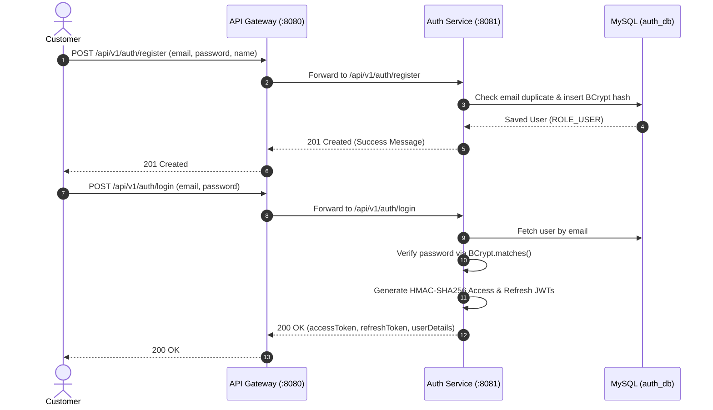
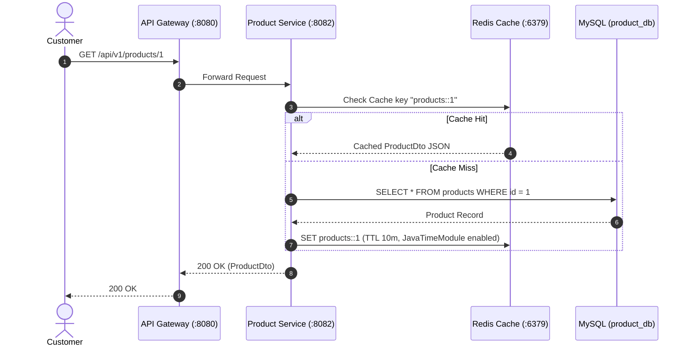
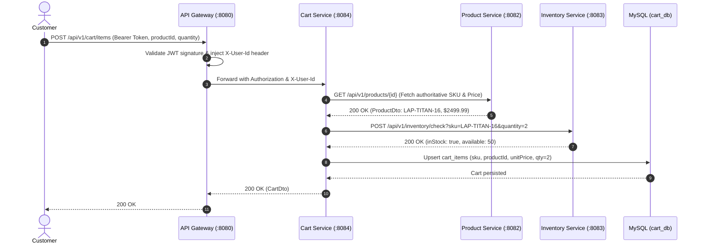
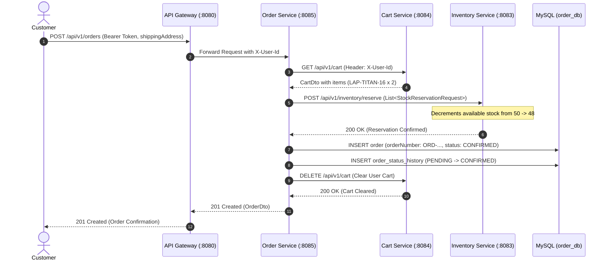
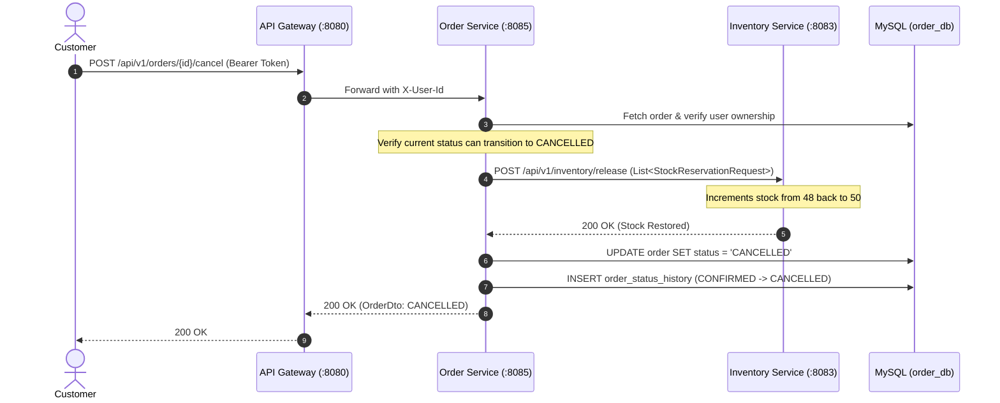

# Enterprise E-Commerce Platform — Complete System Flow & Architecture Guide

This document provides a comprehensive, production-grade architectural guide and end-to-end execution flow reference for the **Novamart Enterprise E-Commerce Platform**.

---

## 1. System Topology & Architecture

The platform is designed following strict microservice principles: **Zero Monolithic Shared Databases**, **Centralized Ingress API Gateway**, **Stateless JWT Security**, and **Isolated Domain Responsibilities**.

```mermaid
graph TD
    Client["Browser / Frontend SPA (React + TypeScript)<br/>Port 3000"]
    Gateway["API Gateway (Spring Cloud Gateway / Netty)<br/>Port 8080"]

    subgraph Microservices ["Enterprise Microservices Tier"]
        Auth["Auth Service (Port 8081)<br/>Spring Security + JWT"]
        Product["Product Service (Port 8082)<br/>Catalog & Categories"]
        Inventory["Inventory Service (Port 8083)<br/>Stock & Atomic Reservations"]
        Cart["Cart Service (Port 8084)<br/>Active Shopping Sessions"]
        Order["Order Service (Port 8085)<br/>Order Placement & State Machine"]
    end

    subgraph DataTier ["Data & Caching Tier"]
        MySQL[("MySQL 8 Database Container<br/>Port 3306")]
        Redis[("Redis 7 Alpine Cache<br/>Port 6379")]
    end

    Client -->|HTTP / REST| Gateway
    Gateway -->|/api/v1/auth/**| Auth
    Gateway -->|/api/v1/products/**, /categories/**| Product
    Gateway -->|/api/v1/inventory/**| Inventory
    Gateway -->|/api/v1/cart/**| Cart
    Gateway -->|/api/v1/orders/**| Order

    Product <-->|Read / Write Distributed Cache| Redis
    
    Order -.->|Inter-Service REST (Port 8082)| Product
    Order -.->|Inter-Service REST (Port 8083)| Inventory
    Order -.->|Inter-Service REST (Port 8084)| Cart
    Cart -.->|Inter-Service REST (Port 8082)| Product
    Cart -.->|Inter-Service REST (Port 8083)| Inventory

    Auth -->|Flyway / JPA| MySQL
    Product -->|Flyway / JPA| MySQL
    Inventory -->|Flyway / JPA| MySQL
    Cart -->|Flyway / JPA| MySQL
    Order -->|Flyway / JPA| MySQL
```

---

## 2. Infrastructure & Port Mapping

| Service Name | Container Name | Host Port | Internal Port | Runtime Technology | Purpose |
| :--- | :--- | :--- | :--- | :--- | :--- |
| **Frontend** | `ecommerce-frontend` | `3000` | `80` | Nginx + React 18 + Vite | Customer Storefront & Admin Portal |
| **API Gateway** | `api-gateway` | `8080` | `8080` | Spring WebFlux / Netty | Ingress Routing, CORS, JWT Ingress Validation |
| **Auth Service** | `auth-service` | `8081` | `8081` | Spring Boot 3 + Tomcat | User Registration, Login, Token Refresh |
| **Product Service** | `product-service` | `8082` | `8082` | Spring Boot 3 + Tomcat | Catalog Management, Categories, Redis Cache |
| **Inventory Service** | `inventory-service` | `8083` | `8083` | Spring Boot 3 + Tomcat | Real-time Stock, Reservations, Restock |
| **Cart Service** | `cart-service` | `8084` | `8084` | Spring Boot 3 + Tomcat | Shopping Cart Session Management |
| **Order Service** | `order-service` | `8085` | `8085` | Spring Boot 3 + Tomcat | Order Orchestration, State Machine |
| **MySQL Database** | `ecommerce-mysql` | `3306` | `3306` | MySQL 8.0 Official | 5 Isolated Database Schemas |
| **Redis Cache** | `ecommerce-redis` | `6379` | `6379` | Redis 7 Alpine | Distributed High-Performance Caching |

---

## 3. Database Isolation & Schemas

Each microservice communicates exclusively with its designated schema using credentials configured via Docker Compose:

1. **`auth_db`**: Tables `users`, `roles`, `user_roles`. Manages credentials (BCrypt hashed) and RBAC permissions.
2. **`product_db`**: Tables `categories`, `products`. Manages product metadata, pricing, category taxonomy, and SKU references.
3. **`inventory_db`**: Tables `inventory_items`. Manages total quantity, reserved quantity, and atomic availability calculations (`available = quantity - reservedQuantity`).
4. **`cart_db`**: Tables `carts`, `cart_items`. Tracks active user shopping carts with snapshot prices and SKU quantities.
5. **`order_db`**: Tables `orders`, `order_items`, `order_status_history`. Stores immutable historical order snapshots, customer emails, shipping addresses, and chronological state machine transitions.

---

## 4. End-to-End User Journeys & Sequence Flows

### Flow A: Customer Registration & Authentication



---

### Flow B: Product Browsing with Redis Caching



---

### Flow C: Add Item to Cart & Stock Check



---

### Flow D: Checkout, Atomic Reservation & Cart Clearing



---

### Flow E: Order Cancellation & Automated Inventory Restock



---

## 5. Order State Machine Specification

Orders follow a strict transition pipeline enforced by `OrderStatus.java`:

```
                 [PENDING]
                     │
                     ▼
                [CONFIRMED] ─────────────┐
                     │                   │
                     ▼                   │
                [PROCESSING] ────────────┼──► [CANCELLED] (Stock Restocked)
                     │                   │
                     ▼                   │
                 [SHIPPED]               │
                     │                   │
                     ▼                   │
                [DELIVERED]              │
                     (Terminal)          (Terminal)
```

- **Cancellable States**: `PENDING`, `CONFIRMED`, `PROCESSING`.
- **Non-Cancellable States**: `SHIPPED`, `DELIVERED`, `CANCELLED`.
- **Cancellation Restock Trigger**: Any cancellation automatically issues `POST /api/v1/inventory/release` for all line items.

---

## 6. Default Seeded Credentials

| Role | Email | Password | Granted Authorities |
| :--- | :--- | :--- | :--- |
| **Platform Administrator** | `admin@ecommerce.com` | `Admin123!` | `ROLE_ADMIN`, `ROLE_USER` |
| **Standard Customer** | `user@ecommerce.com` | `User123!` | `ROLE_USER` |

---

## 7. Complete API Endpoint Reference

All endpoints are accessible via the unified API Gateway at **`http://localhost:8080`**:

### Auth Service (`/api/v1/auth`)
- `POST /api/v1/auth/register`: Register new customer account.
- `POST /api/v1/auth/login`: Authenticate and receive JWT tokens.
- `POST /api/v1/auth/refresh`: Exchange refresh token for new access token.

### Product Service (`/api/v1/products` & `/api/v1/categories`)
- `GET /api/v1/products`: Paginated product catalog with search, price, and category filters.
- `GET /api/v1/products/{id}`: Detailed product snapshot (Redis-cached).
- `POST /api/v1/products`: Create new product (Admin only).
- `PUT /api/v1/products/{id}`: Update product details (Admin only).
- `DELETE /api/v1/products/{id}`: Deactivate product (Admin only).
- `GET /api/v1/categories`: List all product categories.
- `POST /api/v1/categories`: Create category (Admin only).

### Inventory Service (`/api/v1/inventory`)
- `GET /api/v1/inventory/{sku}`: Query real-time availability for product SKU.
- `POST /api/v1/inventory/check`: Check if requested quantity is in stock.
- `POST /api/v1/inventory/reserve`: Atomically reserve stock units.
- `POST /api/v1/inventory/release`: Release reserved stock units back to inventory.
- `PUT /api/v1/inventory/stock`: Adjust stock level for SKU.

### Cart Service (`/api/v1/cart`)
- `GET /api/v1/cart`: Retrieve authenticated user's active cart.
- `POST /api/v1/cart/items`: Add product item to cart.
- `PUT /api/v1/cart/items/{itemId}`: Update item quantity.
- `DELETE /api/v1/cart/items/{itemId}`: Remove line item from cart.
- `DELETE /api/v1/cart`: Clear all cart contents.

### Order Service (`/api/v1/orders`)
- `POST /api/v1/orders`: Place order using active cart contents or explicit items.
- `GET /api/v1/orders`: Paginated order history for authenticated customer.
- `GET /api/v1/orders/{id}`: Detailed order snapshot with line items and status history.
- `POST /api/v1/orders/{id}/cancel`: Cancel order and trigger inventory release.
- `GET /api/v1/orders/admin`: Paginated overview of all orders across platform (Admin only).
- `PUT /api/v1/orders/admin/{id}/status`: Advance order along the state machine pipeline (Admin only).

---

## 8. Automated End-to-End Verification Script

A PowerShell script `test_e2e_flow.ps1` is included in the workspace root to execute the full 13-stage lifecycle in one command:

```powershell
powershell -ExecutionPolicy Bypass -File .\test_e2e_flow.ps1
```

### Stages Verified by Script:
1. Dynamic User Registration
2. Customer JWT Authentication
3. Admin JWT Authentication & Role Verification
4. Product Catalog & Category Queries
5. Inventory Verification via Gateway
6. Add Item to Shopping Cart
7. Shopping Cart Inspection & Price Subtotal Calculation
8. Checkout & Order Placement (`ORD-YYYYMMDD-XXXXXX`)
9. Inventory Stock Decrement Verification
10. Automatic Cart Clearing Post-Checkout
11. Customer Order History Inspection
12. Admin Order Status State Machine Transition (`PROCESSING`)
13. Order Cancellation & Stock Restock Verification
