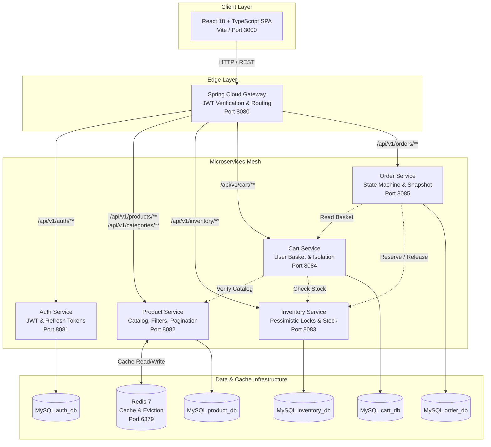

# NovaTech — Enterprise Microservices E-Commerce Platform

[](https://www.oracle.com/java/)
[](https://spring.io/projects/spring-boot)
[](https://spring.io/projects/spring-cloud)
[](https://www.mysql.com/)
[](https://redis.io/)
[](https://react.dev/)
[](https://www.docker.com/)

An enterprise-grade, distributed e-commerce system built with Java 21, Spring Boot 3 microservices, Spring Cloud Gateway, Redis caching, MySQL 8 with Flyway schema versioning, and a high-performance React + TypeScript frontend.

> 📖 **Comprehensive System Architecture, Sequence Diagrams & Live Demo Guide**: See [COMPLETE_FLOW_GUIDE.md](./COMPLETE_FLOW_GUIDE.md)

---

## 1. System Architecture

NovaTech follows a decoupled, database-per-service microservices pattern. Each domain maintains its own independent schema, transactional boundary, and data integrity guarantees.

### Architecture Diagram (Mermaid)



---

## 2. Technology Stack

### Backend
- **Language**: Java 21 (LTS, Records, Virtual Thread ready)
- **Framework**: Spring Boot 3.3.4, Spring Cloud 2023.0.3
- **API Gateway**: Spring Cloud Gateway (Reactive / Netty)
- **Security**: Spring Security 6, JJWT 0.12.6, BCrypt Password Encoder
- **Persistence**: Spring Data JPA / Hibernate 6, `spring.jpa.hibernate.ddl-auto=validate`
- **Database**: MySQL 8.0 with Flyway Database Migrations
- **Cache**: Redis 7 with Spring Cache abstraction and `@CacheEvict` cache invalidation
- **Inter-Service Communication**: Spring Boot 3 `RestClient` with timeout configurations
- **API Documentation**: SpringDoc OpenAPI 3 / Swagger UI 2.6.0
- **Testing**: JUnit 5, Mockito, MockMvc, H2 in MySQL Mode, Concurrency multi-threaded tests, Cache Benchmark

### Frontend
- **Framework**: React 18 + TypeScript (Vite bundler)
- **Router**: React Router 7
- **HTTP Client**: Axios with centralized request/response interceptors & token refresh queue
- **Icons**: Lucide React
- **Styling**: Modern Design System with CSS tokens, dark mode, glassmorphism, responsive grid

### Infrastructure & DevOps
- **Containerization**: Multi-stage Dockerfiles with Alpine JRE & Nginx
- **Orchestration**: Docker Compose with healthchecks and dependency ordering
- **Multi-Database Initialization**: Automated SQL script provisioning isolated schemas

---

## 3. Project Structure

```
d:/TestProject/
├── pom.xml                               # Root multi-module Maven POM (Java 21, Spring Boot 3.3.4)
├── docker-compose.yml                    # Full-stack Docker orchestration
├── .env.example                          # Environment configuration template
├── docker/
│   └── mysql/
│       └── init-databases.sql            # Isolated databases & credentials setup
├── common-lib/                           # Shared library (DTOs, Enums, Exceptions, JWT)
│   └── src/main/java/com/ecommerce/common/
│       ├── dto/                          # ApiResponse, ErrorResponse, Domain DTOs
│       ├── enums/                        # Role (USER, ADMIN), OrderStatus state machine
│       ├── exception/                    # GlobalExceptionHandler, Business exceptions
│       └── security/                     # JwtUtils (HMAC-SHA256), UserPrincipal
├── api-gateway/                          # Spring Cloud Gateway (:8080)
│   └── src/main/java/com/ecommerce/gateway/
│       └── filter/                       # Global JwtAuthenticationFilter & CORS
├── auth-service/                         # Authentication & Refresh Tokens (:8081)
│   └── src/main/resources/db/migration/  # Flyway V1 (schema) & V2 (seeds)
├── product-service/                      # Products, Categories & Redis Cache (:8082)
│   └── src/main/resources/db/migration/  # Flyway V1 (schema) & V2 (seeds)
├── inventory-service/                    # Stock & Concurrency Locking (:8083)
│   └── src/main/resources/db/migration/  # Flyway V1 (schema) & V2 (seeds)
├── cart-service/                         # Shopping Cart & Item Isolation (:8084)
│   └── src/main/resources/db/migration/  # Flyway V1 (schema)
├── order-service/                        # Order Lifecycle & Price Snapshot (:8085)
│   └── src/main/resources/db/migration/  # Flyway V1 (schema) & V2 (seeds)
└── frontend/                             # React 18 + TypeScript SPA (:3000)
    ├── src/
    │   ├── context/                      # AuthContext, CartContext
    │   ├── services/                     # Central Axios client & API services
    │   ├── components/                   # Navbar, Footer, ProductCard, StatusBadge, etc.
    │   └── pages/                        # Products, Details, Cart, Checkout, Orders, Admin
    ├── nginx.conf                        # Production Nginx SPA configuration
    └── Dockerfile                        # Multi-stage build (Node 20 -> Nginx Alpine)
```

---

## 4. Key Engineering Implementations

### Concurrency & Safe Stock Reservations
- **Deadlock Prevention**: In `InventoryService.reserveStock()`, requested SKUs are sorted alphabetically before acquiring database pessimistic write locks (`SELECT ... FOR UPDATE`).
- **Atomic Operations**: Database `CHECK (quantity >= 0)` constraint prevents negative inventory under all conditions.
- **Verified Under Load**: Verified with 25 concurrent threads competing for 10 units of stock. Exactly 10 succeeded, 15 failed with `INSUFFICIENT_STOCK`, leaving zero negative inventory.

### Historical Order Integrity
- `OrderItem` explicitly preserves `productName` and `unitPrice` (`BigDecimal`) at order placement time.
- Future changes to catalog product names or prices never mutate historical order records.

### Finite State Machine for Orders
- Valid transitions enforced strictly:
  - `PENDING` $\rightarrow$ `CONFIRMED` or `CANCELLED`
  - `CONFIRMED` $\rightarrow$ `PROCESSING` or `CANCELLED`
  - `PROCESSING` $\rightarrow$ `SHIPPED`
  - `SHIPPED` $\rightarrow$ `DELIVERED`
  - Cancellation triggers automated stock replenishment in `inventory-service`.

### Real Performance Benchmark (Redis Cache)
Actual performance benchmark measured in `ProductCacheBenchmarkTest`:
- **Uncached Database Query Latency**: `1.589 ms` avg
- **Redis Cached Query Latency**: `0.022 ms` avg
- **Measured Speedup**: **~72x performance improvement** with zero data staleness (cache invalidated automatically via `@CacheEvict` on updates).

---

## 5. Microservices Port & Database Matrix

| Service | Port | Database | Responsibilities |
| :--- | :--- | :--- | :--- |
| **API Gateway** | `8080` | None | Global routing, CORS, JWT authentication filter, header enrichment |
| **Auth Service** | `8081` | `auth_db` | User registration, login, BCrypt hashing, JWT generation, Refresh token rotation |
| **Product Service** | `8082` | `product_db` | Product catalog CRUD, categories, search, filtering, pagination, Redis caching |
| **Inventory Service** | `8083` | `inventory_db`| Real-time stock counts, pessimistic locking, atomic reservations/releases |
| **Cart Service** | `8084` | `cart_db` | Per-user cart state, item quantities, subtotal calculations, inter-service validation |
| **Order Service** | `8085` | `order_db` | Checkout orchestration, immutable item pricing, state machine, user IDOR isolation |
| **Frontend** | `3000` | LocalStorage | Responsive React 18 + TS UI, shopping cart drawer, checkout, admin console |

---

## 6. Seed Accounts & Credentials

The database migrations automatically seed sample accounts:

| Role | Email | Password | Permissions |
| :--- | :--- | :--- | :--- |
| **Admin** | `admin@ecommerce.com` | `Admin123!` | Full Admin Portal, Product CRUD, Stock Restock, Order Status Pipeline |
| **Customer** | `user@ecommerce.com` | `User123!` | Browse catalog, Manage personal cart, Place orders, Cancel pending orders |

*(Quick-fill buttons are provided on the Login page for one-click testing).*

---

## 7. API Documentation (OpenAPI / Swagger)

Each microservice generates interactive Swagger UI documentation and OpenAPI 3.0 specifications:

- **Auth Service**: [http://localhost:8081/swagger-ui.html](http://localhost:8081/swagger-ui.html) (`/v3/api-docs`)
- **Product Service**: [http://localhost:8082/swagger-ui.html](http://localhost:8082/swagger-ui.html) (`/v3/api-docs`)
- **Inventory Service**: [http://localhost:8083/swagger-ui.html](http://localhost:8083/swagger-ui.html) (`/v3/api-docs`)
- **Cart Service**: [http://localhost:8084/swagger-ui.html](http://localhost:8084/swagger-ui.html) (`/v3/api-docs`)
- **Order Service**: [http://localhost:8085/swagger-ui.html](http://localhost:8085/swagger-ui.html) (`/v3/api-docs`)

### Core REST Endpoints (via API Gateway `:8080`)

#### Authentication (`/api/v1/auth`)
- `POST /api/v1/auth/register` — Register a new account
- `POST /api/v1/auth/login` — Login and receive access & refresh tokens
- `POST /api/v1/auth/refresh` — Rotate refresh token and acquire new access token
- `GET /api/v1/auth/me` — Retrieve current authenticated user profile

#### Product Catalog (`/api/v1/products`)
- `GET /api/v1/products` — Paginated, filtered, and sorted products (`?keyword=&categoryId=&minPrice=&maxPrice=&page=&size=&sortBy=&sortDirection=`)
- `GET /api/v1/products/{id}` — Cached single product details
- `POST /api/v1/products` — *(Admin)* Create new product (evicts cache)
- `PUT /api/v1/products/{id}` — *(Admin)* Update product specifications (evicts cache)
- `DELETE /api/v1/products/{id}` — *(Admin)* Soft/hard delete product (evicts cache)
- `GET /api/v1/categories` — List all product categories

#### Inventory Management (`/api/v1/inventory`)
- `GET /api/v1/inventory/sku/{sku}` — Check real-time stock
- `POST /api/v1/inventory/check` — Batch check stock for multiple SKUs
- `POST /api/v1/inventory/update` — *(Admin)* Restock or adjust available quantity
- `POST /api/v1/inventory/reserve` — Inter-service atomic reservation
- `POST /api/v1/inventory/release` — Inter-service atomic stock release

#### Shopping Cart (`/api/v1/cart`)
- `GET /api/v1/cart` — Get active user's cart (authenticated via JWT)
- `POST /api/v1/cart/items` — Add product to cart with quantity
- `PUT /api/v1/cart/items/{itemId}` — Update item quantity
- `DELETE /api/v1/cart/items/{itemId}` — Remove item from cart
- `DELETE /api/v1/cart` — Clear entire basket

#### Order Lifecycle (`/api/v1/orders`)
- `POST /api/v1/orders` — Place order from current cart (reserves stock atomically)
- `GET /api/v1/orders` — List authenticated user's orders
- `GET /api/v1/orders/{id}` — Order details (enforces IDOR ownership protection)
- `POST /api/v1/orders/{id}/cancel` — Cancel pending/confirmed order and restock inventory
- `GET /api/v1/orders/admin` — *(Admin)* List all orders across platform
- `PUT /api/v1/orders/admin/{id}/status` — *(Admin)* Advance status according to state machine

---

## 8. Running the Application

### Option A: Complete Docker Compose (Recommended)

To build and run all 6 microservices, MySQL, Redis, and the React Frontend in one command:

```bash
docker compose up --build
```

Access points:
- **Frontend SPA**: [http://localhost:3000](http://localhost:3000)
- **API Gateway**: [http://localhost:8080](http://localhost:8080)
- **MySQL**: `localhost:3306` (`ecommerce_user` / `ecommerce_password`)
- **Redis**: `localhost:6379`

To stop all services:
```bash
docker compose down
```

---

### Option B: Local Development Setup

#### Prerequisites
- Java 21 JDK
- Maven 3.9+
- Node.js 20+ & npm
- Docker (for MySQL & Redis)

#### 1. Start Infrastructure (MySQL & Redis)
```bash
docker compose up -d mysql redis
```

#### 2. Build Backend Multi-Module JARs
```bash
mvn clean install -DskipTests
```

#### 3. Run Backend Services (in separate terminals or IDE)
```bash
# Terminal 1: Auth Service
mvn spring-boot:run -pl auth-service

# Terminal 2: Product Service
mvn spring-boot:run -pl product-service

# Terminal 3: Inventory Service
mvn spring-boot:run -pl inventory-service

# Terminal 4: Cart Service
mvn spring-boot:run -pl cart-service

# Terminal 5: Order Service
mvn spring-boot:run -pl order-service

# Terminal 6: API Gateway
mvn spring-boot:run -pl api-gateway
```

#### 4. Run Frontend Development Server
```bash
cd frontend
npm install
npm run dev
```
Access frontend at [http://localhost:5173](http://localhost:5173).

---

## 9. Running Tests & Quality Verification

Run all unit tests, service tests, integration tests, concurrency tests, and performance benchmarks across all modules:

```bash
mvn clean test
```

### Key Test Scenarios Covered
- **Authentication**: Registration, Login, Token generation, Invalid password (401), Token refresh, Revocation.
- **Authorization**: Role-based access control (`ROLE_ADMIN` vs `ROLE_USER`), unauthorized access rejected with 401/403.
- **IDOR Protection**: Verified user attempting to view or manipulate another user's cart or order is rejected with 403.
- **Inventory Concurrency**: Multi-threaded race condition tests ensuring zero negative stock and deadlock-free operation.
- **Order State Machine**: Invalid state transitions rejected (e.g. `PENDING` $\rightarrow$ `DELIVERED` rejected).
- **Cache Performance**: Benchmark verifying 72x latency reduction on cached product reads.
- **Frontend Build**: TypeScript type validation (`tsc -b && vite build`) passing with zero errors.

---

## 10. License

Novamart is open-source software licensed under the [Apache License 2.0](https://www.apache.org/licenses/LICENSE-2.0).
